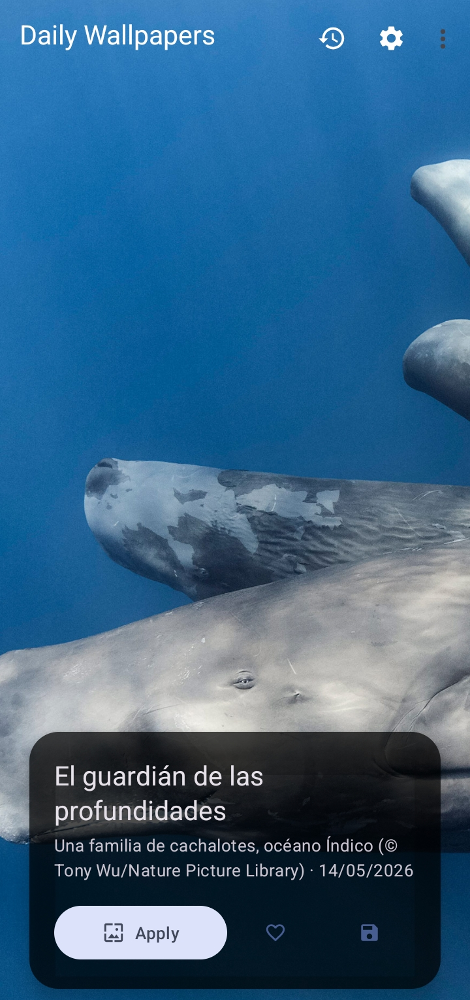
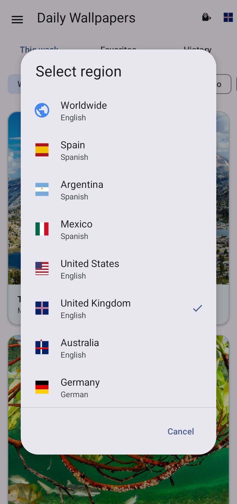
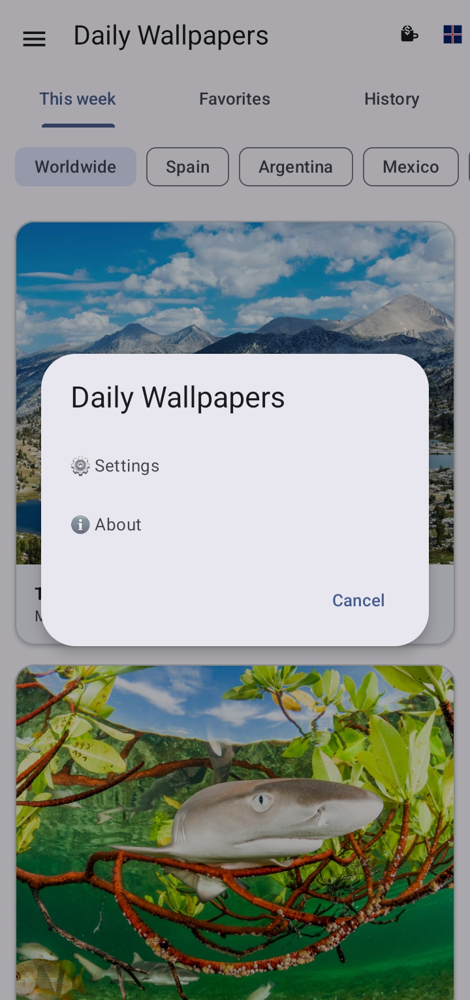
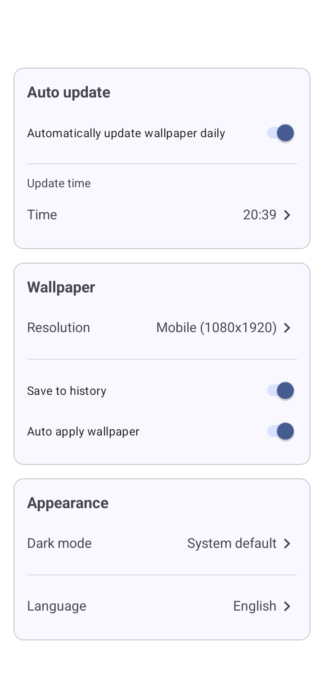

# 🌄 Daily Wallpapers

[](https://kotlinlang.org)
[](https://developer.android.com)
[](https://m3.material.io)

Una aplicación Android que trae el **fondo de pantalla diario de Bing** directamente a tu dispositivo. Personaliza tu pantalla de inicio y bloqueo con imágenes espectaculares que se actualizan automáticamente cada día.

<p align="center">
  
  
  
</p>

## ✨ Características

| Característica | Descripción |
|----------------|-------------|
| 🖼️ **Fondo Diario** | Obtiene automáticamente la nueva imagen de Bing cada día |
| 📱 **Dos Resoluciones** | HD (1920x1080) para tablets y móvil (1080x1920) para teléfonos |
| 🔒 **Pantalla de Bloqueo** | Aplica fondos a la pantalla de bloqueo (Android 7+) |
| ⭐ **Favoritos** | Marca tus imágenes preferidas |
| 📚 **Historial** | Guarda automáticamente el historial de fondos vistos |
| 💾 **Guardar en Galería** | Descarga y guarda tus wallpapers favoritos |
| ⚡ **Actualización Silenciosa** | El worker en segundo plano descarga nuevas imágenes |
| 🌙 **Modo Oscuro** | Compatible con tema oscuro del sistema |
| 🎨 **Material You** | Colores dinámicos que siguen tu fondo de pantalla |
| 🌐 **Multi-idioma** | Español e inglés soportados |

## 📱 Requisitos

- **Android 6.0 (API 23) o superior**
- Conexión a internet para descargar wallpapers
- Espacio de almacenamiento para guardar imágenes

## 🚀 Instalación

### 📲 Desde tiendas de aplicaciones

| Tienda | Enlace |
|--------|--------|
| **F-Droid** | [](https://f-droid.org/packages/com.gnzalobnites.dailywallpapers) |
| **APKPure** | [](https://apkpure.net/daily-walpappers/com.gnzalobnites.dailywallpapers) |

Desde Releases

1. Descarga el APK desde la sección Releases
2. Habilita "Instalar desde orígenes desconocidos" en tu dispositivo
3. Abre el APK e instala

Desde código fuente

```bash
git clone https://github.com/gnzalobnites/daily-wallpapers.git
cd daily-wallpapers
# Abrir en Android Studio y compilar
```

🛠️ Tecnologías

| Tecnología       | Uso                                                |
|------------------|----------------------------------------------------|
| Kotlin           | Lenguaje principal                                 |
| MVVM             | Arquitectura                                      |
| Room             | Base de datos local (historial/favoritos)        |
| DataStore        | Almacenamiento de preferencias                    |
| Retrofit         | Cliente HTTP para API de Bing                     |
| Coroutines       | Programación asíncrona                            |
| Glide/Coil       | Carga y caché de imágenes                         |
| WorkManager      | Actualizaciones automáticas en segundo plano      |
| Navigation Component | Navegación entre fragments                    |
| Material 3       | UI componentes y temas                            |

📂 Estructura del Proyecto

```
app/src/main/java/com/gnzalobnites/dailywallpapers/
├── data/
│   ├── api/              # Retrofit + Bing API
│   ├── database/         # Room (Dao, Database, Converters)
│   ├── model/            # BingImage, BingResponse
│   ├── preferences/      # PreferencesManager (DataStore)
│   └── repository/       # WallpaperRepository
├── ui/
│   ├── main/             # MainFragment + MainViewModel
│   ├── history/          # Historial de wallpapers
│   ├── settings/         # Configuración de la app
│   ├── about/            # Información de la app
│   └── preview/          # Diálogo de previsualización
├── utils/                # SingleLiveEvent, UpdateManager, AppUpdater
├── worker/               # DailyWallpaperWorker + WorkerScheduler
├── MainActivity.kt
└── WallpaperApp.kt
```

⚙️ Configuración

La aplicación permite las siguientes opciones de configuración:

| Opción                | Valores               | Descripción                                   |
|-----------------------|-----------------------|-----------------------------------------------|
| Actualización Automática | On/Off             | Activa/desactiva descarga diaria              |
| Hora de Actualización | HH:MM                 | Hora para la descarga automática              |
| Resolución            | HD / Móvil            | Calidad de imagen                             |
| Guardar Historial     | On/Off                | Guarda automáticamente en historial           |
| Aplicar Automático    | On/Off                | Aplica el wallpaper sin confirmación          |
| Modo Oscuro           | Light/Dark/System     | Tema de la aplicación                         |
| Idioma                | Español/English       | Idioma de la UI                               |

🔄 Actualizaciones Automáticas

La app utiliza WorkManager para programar actualizaciones diarias:

1. El WorkerScheduler programa un OneTimeWorkRequest para la hora configurada
2. DailyWallpaperWorker descarga la imagen más reciente de Bing
3. Si autoApply = true, aplica automáticamente el wallpaper
4. Guarda en historial si saveToHistory = true
5. Reprograma la siguiente actualización para el día siguiente

🎯 Funcionalidades Detalladas

Aplicar Wallpaper

```kotlin
// Aplicar a pantalla principal, bloqueo o ambas
applyWallpaper(image, location) // 1=Home, 2=Lock, 3=Both
```

Guardar en Galería

- Permiso WRITE_EXTERNAL_STORAGE para Android 9 o inferior
- Android 10+ usa MediaStore sin permisos
- Guarda en Pictures/DailyWallpapers/

Favoritos

- Toggle desde botón en MainFragment
- Persistencia en Room
- Filtro en historial para ver solo favoritos

📸 Capturas de Pantalla

<p align="center">
  
  
  
  
</p>

🧪 Testing

```bash
# Ejecutar pruebas unitarias
./gradlew test

# Ejecutar pruebas instrumentadas
./gradlew connectedAndroidTest
```

📦 Build

```bash
# Build Debug APK
./gradlew assembleDebug

# Build Release APK (requiere keystore)
./gradlew assembleRelease

# Generar AAB para Play Store
./gradlew bundleRelease
```

🤝 Contribuciones

Las contribuciones son bienvenidas. Por favor:

1. Fork el proyecto
2. Crea tu rama (git checkout -b feature/AmazingFeature)
3. Commit tus cambios (git commit -m 'Add some AmazingFeature')
4. Push a la rama (git push origin feature/AmazingFeature)
5. Abre un Pull Request

📄 Licencia

Este proyecto está bajo la licencia MIT. Ver el archivo LICENSE para más detalles.

📧 Contacto

Desarrollador: Gonzalo Gastón Benites
Email: gnzbnites@gmail.com
GitHub: @gnzalobnites

🙏 Agradecimientos

- Bing Wallpaper API - Por proveer las imágenes diarias
- Material Design - Por las guías de diseño
- Todos los contribuidores y usuarios de la app
